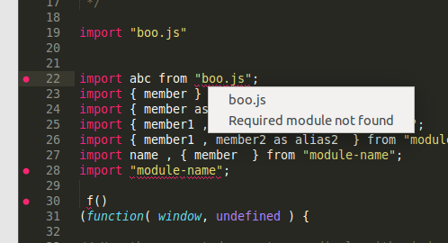
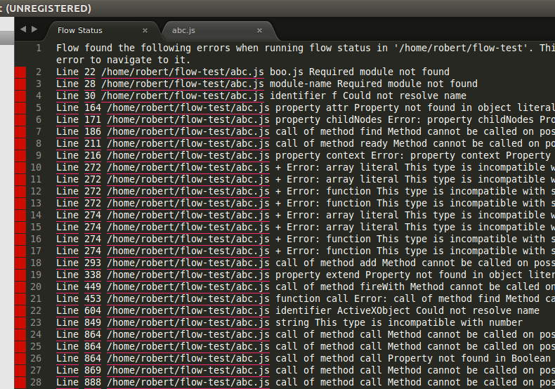
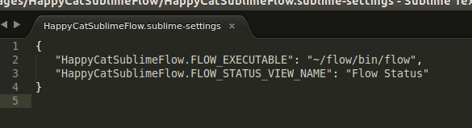

#  About

This plugin is a failed attempt to integrate Facebook flow into sublime text.  The idea was to provide functionality that would make it easy to navigate and find javascript errors from within sublime.  After spending quite a bit of time researching and prototyping what plugin UI features exist, it was decided that Sublime's plugin API is not currently adequate for implementing this type of plugin in a way that has a high quality user experience.  Reasons are listed in the next section.

#  Difficulty Building UI Features In Sublime

Feel free to correct me if I'm wrong on these conclusions:

-  It is not possible to change the cursor to a hand icon to suggest to the user that you can click on certain text.
-  No detection for hovering on text at all.
-  Single click for showing detailed error information isn't a practical alternative to hovering and causes a very negative user experience (you get error info when you click on a line trying to edit it).  Double-clicking was used instead.
-  No ability to implement a 'status window' at the bottom of the screen (similar to MS Visual Studio's error section).  Printing to the console isn't a practical alternative.
-  Simply changing the colour of underlined text has no obvious simple solution.  This is definitely possible (it is done in https://github.com/Monnoroch/ColorHighlighter) but, my investigation suggests, that you need to jump through elaborate hoops by defining the underline as a style using hard-coded colour values in memory for each color according to an XML format,  then register this somewhere else.  This must be done for every individual colour underline that you use (as far as I can tell).
-  Many other desirable UI enhancements either don't exist or are undocumented.

#  Features

An error menu that pops up when you double-click on an underlined error.  In the future, clicking on this menu could automatically navigate somewhere relevant.  Right now, clicking on the menu does nothing.

A list of all errors in the project that shows in the 'Flow Status' window.  You can automatically navigate to the error by double-clicking on the underlined error line and filename:

Configure the location of the flow server executable:

#  TODO

These tasks were not completed since the original goals of the plugin don't seem to be achievable in a reasonable amount of time (or not at all, given the UI mechanisms that Sublime offers).

-  Don't use full verbose method of loading settings, initialise these constants first.  This requires more careful thought since the settings object is loaded asynchronously, and attempting to use a setting too early would result in its value being 'None'.  This forum post (http://www.sublimetext.com/forum/viewtopic.php?f=6&p=47439) suggests that it should be safe to call inside 'plugin\_loaded', although this still caused problems for me.
-  When an error popup menu appears (from double-clicking on an error), navigate the user to the relevant section of the code that appears in the menu (such as a function definition).
-  Currently the threading access global variables, and isn't organized very well.  Something like a thread server would be a better approach.  If you attempt this, you'll need to be careful that you don't go outside a context where you can use the 'edit' variable from the TextCommand class.  You'll need to jump through some hoops to avoid getting this error: ValueError: Edit objects may not be used after the TextCommand's run method has returned

#  Conclusion

It is likely still possible to make a fairly good plugin using the UI features that are available, but at this point the time investment doesn't seem to be worth the ROI.
